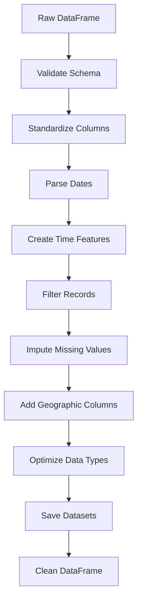

## Overview

The `cleaning` module provides a comprehensive data cleaning pipeline for COVID-19 datasets from Our World in Data. It handles schema validation, column standardization, date parsing, feature engineering, missing value imputation, and data type optimization.

## Import

```python
import cleaning
```

---

## Main Function

### clean_dataset()

Performs complete cleaning and preprocessing of the Our World in Data COVID-19 dataset.

```python
cleaning.clean_dataset(
    df,
    ruta_csv=None,
    ruta_schema=None,
    gen_summaries=False,
    start_date='2020-01-01',
    end_date='2023-12-31'
)
```

<ParamField path="df" type="pd.DataFrame" required>
  Raw COVID-19 DataFrame to clean
</ParamField>

<ParamField path="ruta_csv" type="str | None" default="None">
  Path where the cleaned dataset will be saved as CSV (optional)
</ParamField>

<ParamField path="ruta_schema" type="str | None" default="None">
  Path where the schema (data types) will be saved as JSON (optional)
</ParamField>

<ParamField path="gen_summaries" type="bool" default="False">
  If True, generates additional aggregated datasets (weekly, monthly, quarterly, yearly)
</ParamField>

<ParamField path="start_date" type="str" default="'2020-01-01'">
  Start date for filtering records (format: 'YYYY-MM-DD')
</ParamField>

<ParamField path="end_date" type="str" default="'2023-12-31'">
  End date for filtering records (format: 'YYYY-MM-DD')
</ParamField>

**Returns:** `tuple` - `(df_clean, df_weekly, df_monthly, df_quarterly, df_yearly)`
- If `gen_summaries=False`: Returns `(df_clean, None, None, None, None)`
- If `gen_summaries=True`: Returns all five DataFrames

<Note>
The cleaning pipeline includes:
1. Schema validation (61 required columns)
2. Column name standardization (lowercase, trimmed)
3. Date parsing and validation
4. Temporal feature creation (year, quarter, month, week, weekday, day, is_weekend)
5. Record filtering (date range, sovereign countries only)
6. Missing value imputation (sophisticated strategies per variable type)
7. Derived variable calculation (vaccination ratios, smoothed values, per-capita metrics)
8. Data type optimization (categories, float32, int8)
9. Optional aggregated datasets generation
</Note>

#### Example

<CodeGroup>
```python Basic Usage
import pandas as pd
import cleaning

# Load raw data
df_raw = pd.read_csv('owid-covid-data.csv')

# Clean dataset (no saving)
df_clean, _, _, _, _ = cleaning.clean_dataset(df_raw)

print(f"Cleaned dataset shape: {df_clean.shape}")
```

```python With File Output
import pandas as pd
import cleaning

# Load and clean with file output
df_raw = pd.read_csv('owid-covid-data.csv')

df_clean, _, _, _, _ = cleaning.clean_dataset(
    df_raw,
    ruta_csv='outputs/owid-covid-data-clean.csv',
    ruta_schema='outputs/schemas/schema-clean.json',
    start_date='2020-01-01',
    end_date='2023-12-31'
)
```

```python Generate Aggregated Datasets
import pandas as pd
import cleaning

df_raw = pd.read_csv('owid-covid-data.csv')

# Generate all temporal aggregations
df, df_weekly, df_monthly, df_quarterly, df_yearly = cleaning.clean_dataset(
    df_raw,
    ruta_csv='outputs/owid-covid-data-clean.csv',
    ruta_schema='outputs/schemas/schema-clean.json',
    gen_summaries=True
)

print(f"Daily: {df.shape}")
print(f"Weekly: {df_weekly.shape}")
print(f"Monthly: {df_monthly.shape}")
print(f"Quarterly: {df_quarterly.shape}")
print(f"Yearly: {df_yearly.shape}")
```
</CodeGroup>

---

## Internal Pipeline Functions

The following functions are called internally by `clean_dataset()`. They can also be used independently for custom pipelines.

### _validate_schema()

Validates that the DataFrame contains exactly the required columns for the COVID-19 dataset.

```python
cleaning._validate_schema(df, required_cols)
```

<ParamField path="df" type="pd.DataFrame" required>
  DataFrame to validate
</ParamField>

<ParamField path="required_cols" type="list" required>
  List of required column names
</ParamField>

**Returns:** `pd.DataFrame` - The input DataFrame (unchanged)

**Raises:** `ValueError` if columns are missing or extra columns exist

#### Example

```python
required = ['country', 'date', 'total_cases', 'total_deaths']
df_validated = cleaning._validate_schema(df, required)
```

---

### _standardize_cols()

Standardizes column names by trimming whitespace and converting to lowercase.

```python
cleaning._standardize_cols(df)
```

<ParamField path="df" type="pd.DataFrame" required>
  DataFrame with columns to standardize
</ParamField>

**Returns:** `pd.DataFrame` - DataFrame with standardized column names

#### Example

```python
df_std = cleaning._standardize_cols(df)
# 'Total Cases' -> 'total cases'
# '  Country  ' -> 'country'
```

---

### _parse_dates()

Converts the date column to datetime format and removes records with invalid dates.

```python
cleaning._parse_dates(df, date_col='date')
```

<ParamField path="df" type="pd.DataFrame" required>
  DataFrame with date column
</ParamField>

<ParamField path="date_col" type="str" default="'date'">
  Name of the date column to parse
</ParamField>

**Returns:** `pd.DataFrame` - DataFrame with parsed dates and invalid dates removed

#### Example

```python
df_dated = cleaning._parse_dates(df, date_col='date')
print(df_dated['date'].dtype)  # datetime64[ns]
```

---

### _create_aux_features()

Creates temporal features from the date column for time series analysis.

```python
cleaning._create_aux_features(df)
```

<ParamField path="df" type="pd.DataFrame" required>
  DataFrame with a 'date' column (datetime type)
</ParamField>

**Returns:** `pd.DataFrame` - DataFrame with added temporal features:
- `year` (int): Year
- `quarter` (int): Quarter (1-4)
- `month` (int): Month (1-12)
- `week` (int): ISO week number
- `weekday` (int): Day of week (0=Monday, 6=Sunday)
- `day` (int): Day of month
- `is_weekend` (bool): True if Saturday or Sunday

#### Example

```python
df_features = cleaning._create_aux_features(df)
print(df_features[['date', 'year', 'quarter', 'month', 'is_weekend']].head())
```

---

### _remove_records()

Filters records by date range and keeps only sovereign countries.

```python
cleaning._remove_records(df, start_date, end_date)
```

<ParamField path="df" type="pd.DataFrame" required>
  DataFrame to filter
</ParamField>

<ParamField path="start_date" type="str" required>
  Start date (format: 'YYYY-MM-DD')
</ParamField>

<ParamField path="end_date" type="str" required>
  End date (format: 'YYYY-MM-DD')
</ParamField>

**Returns:** `pd.DataFrame` - Filtered DataFrame containing only records within the date range and from sovereign countries

<Note>
The function includes a hardcoded list of 195 sovereign countries and filters out aggregated regions (e.g., "World", "Europe").
</Note>

#### Example

```python
df_filtered = cleaning._remove_records(df, '2020-03-01', '2023-06-30')
print(f"Records: {len(df_filtered)}")
```

---

### _impute_missing()

Performs sophisticated missing value imputation for all COVID-19 variables using multiple strategies.

```python
cleaning._impute_missing(df)
```

<ParamField path="df" type="pd.DataFrame" required>
  DataFrame with missing values to impute
</ParamField>

**Returns:** `pd.DataFrame` - DataFrame with imputed values

<Note>
**Imputation Strategies:**

1. **Variable Removal**: Drops columns with >95% missing data (ICU admissions, excess mortality)
2. **External Data Merge**: Merges Human Development Index (HDI) and life expectancy from UN data
3. **Temporal Interpolation**: Uses country-grouped interpolation for cumulative variables (cases, deaths, tests, vaccinations)
4. **ARIMA Forecasting**: Predicts `stringency_index` using auto_arima for dates beyond last reported value
5. **KNN Imputation**: Imputes `extreme_poverty` and `hospital_beds_per_thousand` using similar countries
6. **Continental Averages**: Fills `gdp_per_capita` and `diabetes_prevalence` with continent means
7. **Domain Knowledge**: Sets `handwashing_facilities` to 100% when missing
8. **Derived Variables**: Calculates smoothed values, per-capita metrics, and vaccination ratios
</Note>

#### Example

```python
df_imputed = cleaning._impute_missing(df)
print(f"Remaining nulls: {df_imputed.isnull().sum().sum()}")
```

---

### _add_columns()

Adds geographic coordinates (latitude/longitude) and vaccination ratio columns.

```python
cleaning._add_columns(df)
```

<ParamField path="df" type="pd.DataFrame" required>
  DataFrame to which columns will be added
</ParamField>

**Returns:** `pd.DataFrame` - DataFrame with added columns:
- `lat` (float): Latitude
- `lon` (float): Longitude
- `vaccination_ratio` (float): Percentage of population vaccinated (capped at 100%)
- `fully_vaccination_ratio` (float): Percentage fully vaccinated (capped at 100%)

#### Example

```python
df_geo = cleaning._add_columns(df)
print(df_geo[['country', 'lat', 'lon', 'vaccination_ratio']].head())
```

---

### _set_dtypes()

Optimizes DataFrame memory usage by converting data types.

```python
cleaning._set_dtypes(df)
```

<ParamField path="df" type="pd.DataFrame" required>
  DataFrame to optimize
</ParamField>

**Returns:** `pd.DataFrame` - DataFrame with optimized types:
- `country`, `code`, `continent`: object → category
- Float64 columns → float32
- Temporal integers (`quarter`, `month`, `weekday`, `day`) → int8

<Note>
Type optimization can reduce memory usage by 50-70% for large COVID-19 datasets.
</Note>

#### Example

```python
print(f"Before: {df.memory_usage(deep=True).sum() / 1024**2:.2f} MB")
df_opt = cleaning._set_dtypes(df)
print(f"After: {df_opt.memory_usage(deep=True).sum() / 1024**2:.2f} MB")
```

---

### _save_datasets()

Saves the cleaned dataset and optionally generates and saves aggregated temporal summaries.

```python
cleaning._save_datasets(df, ruta_csv, ruta_schema=None, gen_summaries=False)
```

<ParamField path="df" type="pd.DataFrame" required>
  Cleaned DataFrame to save
</ParamField>

<ParamField path="ruta_csv" type="str" required>
  Path for the main CSV file
</ParamField>

<ParamField path="ruta_schema" type="str | None" default="None">
  Path for schema JSON file (optional)
</ParamField>

<ParamField path="gen_summaries" type="bool" default="False">
  Whether to generate aggregated datasets
</ParamField>

**Returns:** `tuple` - `(df, df_weekly, df_monthly, df_quarterly, df_yearly)`

<Note>
Aggregated datasets use intelligent aggregation:
- **Cumulative variables** (total_cases, total_deaths): Take last value
- **Daily variables** (new_cases, new_deaths): Sum
- **Averages** (stringency_index, tests_per_case): Mean
- **Categorical** (country, continent): Mode
</Note>

#### Example

```python
dfs = cleaning._save_datasets(
    df,
    'outputs/owid-covid-data-clean.csv',
    'outputs/schema-clean.json',
    gen_summaries=True
)

df, df_w, df_m, df_q, df_y = dfs
```

---

## Pipeline Overview

The complete cleaning pipeline executes these steps in order:



**Execution Time:** ~30-90 seconds for full dataset (500k+ rows)

---

## Required Columns

The `clean_dataset()` function requires 61 specific columns. Key columns include:

- **Identifiers**: `country`, `code`, `continent`, `date`
- **Cases**: `total_cases`, `new_cases`, `new_cases_smoothed`, `*_per_million`
- **Deaths**: `total_deaths`, `new_deaths`, `new_deaths_smoothed`, `*_per_million`
- **Tests**: `total_tests`, `new_tests`, `tests_per_case`, `positive_rate`
- **Vaccinations**: `total_vaccinations`, `people_vaccinated`, `people_fully_vaccinated`, `total_boosters`
- **Policy**: `stringency_index`
- **Demographics**: `population`, `population_density`, `median_age`, `life_expectancy`
- **Economic**: `gdp_per_capita`, `extreme_poverty`, `human_development_index`
- **Health**: `diabetes_prevalence`, `hospital_beds_per_thousand`, `handwashing_facilities`

For the complete list, see the source code or validation error messages.