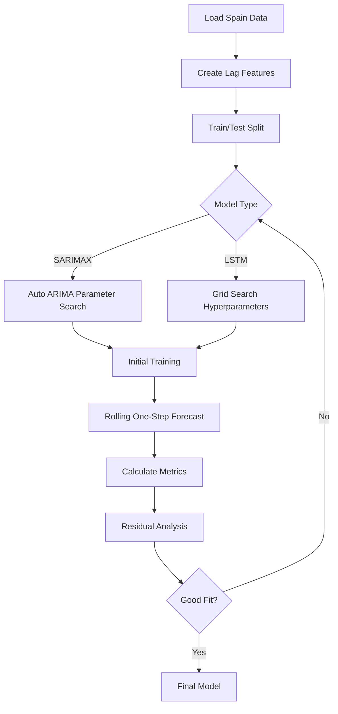

# Predictive Modeling

The predictive modeling module develops time series forecasting models to estimate the evolution of daily COVID-19 deaths in Spain. The primary approach uses **SARIMAX** (Seasonal AutoRegressive Integrated Moving Average with eXogenous variables) to capture complex temporal patterns and external influences.

## Overview

Predicting COVID-19 mortality is challenging due to:

<CardGroup cols={2}>
  <Card title="Data Scarcity" icon="database">
    Limited historical data (4 years, ~1,460 daily records per country)
  </Card>
  <Card title="High Variability" icon="chart-scatter">
    New variants, reporting delays, weekend effects, and policy changes
  </Card>
  <Card title="Multiple Factors" icon="network-wired">
    Mortality depends on cases, vaccinations, age, healthcare capacity, and more
  </Card>
  <Card title="Noise & Artifacts" icon="wave-square">
    Administrative delays, data revisions, and accumulated weekend reports
  </Card>
</CardGroup>

## Target Variable

<Note>
  **Target**: `new_deaths_smoothed_per_million`  
  Daily deaths per million inhabitants after 7-day rolling average smoothing.
</Note>

**Why this variable?**
- **Smoothing**: Mitigates spikes from reporting artifacts
- **Per capita normalization**: Enables cross-country comparison
- **Epidemiological relevance**: Direct measure of pandemic severity

## SARIMAX Model

### Model Specification

SARIMAX extends ARIMA with seasonal components and exogenous variables:

$$
\text{SARIMAX}(p,d,q)(P,D,Q)_m
$$

Where:
- **p**: Autoregressive order
- **d**: Differencing order  
- **q**: Moving average order
- **P, D, Q**: Seasonal components
- **m**: Seasonal period
- **Exogenous variables**: External predictors (e.g., vaccination rate)

### Implementation

```python
# From models.ipynb - SARIMAX model training
from statsmodels.tsa.statespace.sarimax import SARIMAX
import pmdarima as pm

# Auto-select optimal parameters
auto_model = pm.auto_arima(
    y_train,
    exogenous=X_exog_train,
    seasonal=True,
    m=7,  # Weekly seasonality
    stepwise=True,
    suppress_warnings=True,
    error_action='ignore'
)

# Fit SARIMAX model
model = SARIMAX(
    y_train,
    exog=X_exog_train,
    order=auto_model.order,
    seasonal_order=auto_model.seasonal_order
)

res = model.fit(maxiter=200)
```

<Tip>
  **pmdarima's auto_arima** automatically selects optimal (p,d,q) and (P,D,Q) parameters using AIC/BIC criteria, avoiding manual grid search.
</Tip>

### Exogenous Variables

The model includes **vaccination rate** as the primary exogenous predictor:

```python
# Vaccination ratio as key exogenous variable
exog_vars = ['vaccination_ratio']

# Create lagged features for context
for lag in [1, 7, 14]:
    df[f'new_cases_per_million_lag{lag}'] = \
        df.groupby('country')['new_cases_smoothed_per_million'].shift(lag)
    df[f'new_deaths_per_million_lag{lag}'] = \
        df.groupby('country')['new_deaths_smoothed_per_million'].shift(lag)
```

<Accordion title="Why Vaccination Rate?">
  Vaccination campaigns have a direct causal effect on mortality:
  - Reduces severe disease progression
  - Lowers hospitalization rates
  - Decreases overall mortality risk
  
  The model captures this relationship explicitly through the exogenous variable, improving forecast accuracy during vaccination rollout periods.
</Accordion>

## Training Strategy

### Rolling Window One-Step-Ahead Forecast

The model uses a **rolling forecast** approach:

<Steps>
  <Step title="Initial Training">
    Train on the first 425 days (14 months) of Spain's data
    
    $$
    \mathcal{D}_{\text{train}}^{(0)} = \{ (y_t, X_t) \}_{t=1}^{T_0}, \quad T_0 = 425
    $$
  </Step>
  
  <Step title="One-Step Prediction">
    Predict the next day's deaths:
    
    $$
    \hat{y}_{t+1|t} = f(y_1, ..., y_t, X_{t+1})
    $$
  </Step>
  
  <Step title="Model Update (Optional)">
    Re-train model every N days to adapt to new data patterns
  </Step>
  
  <Step title="Rolling Forward">
    Move the window forward by 1 day and repeat
  </Step>
</Steps>

```python
# From models.ipynb - Rolling forecast implementation
def rolling_forecast_sarimax(
    df_spain, 
    target, 
    exog_vars, 
    min_train_size=425,
    retrain_period=30
):
    predictions = []
    
    for t in range(min_train_size, len(df_spain)):
        # Training window
        y_train = df_spain[target].iloc[:t]
        X_train = df_spain[exog_vars].iloc[:t]
        
        # Retrain model periodically
        if t % retrain_period == 0:
            model = SARIMAX(
                y_train, 
                exog=X_train,
                order=order,
                seasonal_order=seasonal_order
            )
            res = model.fit()
        
        # One-step-ahead forecast
        X_next = df_spain[exog_vars].iloc[t:t+1]
        pred = res.forecast(steps=1, exog=X_next)
        predictions.append(pred[0])
    
    return predictions
```

<Note>
  **Retrain Period**: The model can be retrained every N days (e.g., 30 or 60) to adapt to changing pandemic dynamics, preventing model drift.
</Note>

## Model Performance

### Evaluation Metrics

The SARIMAX model achieves:

<CardGroup cols={2}>
  <Card title="RMSE" icon="square-root-alt">
    **0.078**  
    Root Mean Squared Error
  </Card>
  <Card title="MAE" icon="ruler">
    **0.0197**  
    Mean Absolute Error
  </Card>
</CardGroup>

$$
\text{RMSE} = \sqrt{\frac{1}{N}\sum_{t=1}^{N} (y_t - \hat{y}_t)^2}
$$

$$
\text{MAE} = \frac{1}{N}\sum_{t=1}^{N} |y_t - \hat{y}_t|
$$

<Tip>
  These metrics are calculated on **out-of-sample** predictions during the rolling forecast, ensuring true generalization performance.
</Tip>

### Prediction Visualization

```python
# Plotting predictions vs actuals
import matplotlib.pyplot as plt

plt.figure(figsize=(14, 6))
plt.plot(fechas_test, y_test, label='Actual', color='black', alpha=0.7)
plt.plot(fechas_test, predictions, label='Predicted', 
         color='red', linewidth=2, marker='o', markersize=2)
plt.xlabel('Date')
plt.ylabel('Deaths per Million')
plt.title('SARIMAX: One-Step-Ahead Predictions vs Actual')
plt.legend()
plt.grid(alpha=0.3)
plt.show()
```

### Residual Analysis

<Accordion title="Residual Diagnostics">
  ```python
  residuals = y_test - predictions
  
  # Residual time series plot
  plt.figure(figsize=(14, 4))
  plt.plot(fechas_test, residuals, color='orange')
  plt.axhline(0, color='black', linestyle='--')
  plt.title('Residuals: Actual - Predicted')
  plt.xlabel('Date')
  plt.ylabel('Error')
  plt.grid(alpha=0.3)
  plt.show()
  
  # Histogram of residuals
  plt.figure(figsize=(8, 5))
  plt.hist(residuals, bins=30, color='skyblue', edgecolor='black')
  plt.title('Residual Distribution')
  plt.xlabel('Error')
  plt.ylabel('Frequency')
  plt.show()
  ```
  
  Well-behaved residuals should:
  - Be centered around zero (no bias)
  - Show constant variance (homoscedasticity)
  - Follow approximately normal distribution
</Accordion>

## Alternative Approaches Explored

### LSTM Neural Networks

The analysis also explored **LSTM (Long Short-Term Memory)** networks:

<Accordion title="LSTM Architecture">
  ```python
  # From models.ipynb - LSTM model
  from tensorflow.keras.models import Sequential
  from tensorflow.keras.layers import LSTM, Dense, Dropout, Bidirectional
  
  model = Sequential([
      tf.keras.Input(shape=(lookback, n_features)),
      Bidirectional(LSTM(64, return_sequences=True)),
      Bidirectional(LSTM(32, return_sequences=False)),
      Dense(32, activation="relu"),
      Dropout(0.3),
      Dense(1, activation=None)
  ])
  
  model.compile(optimizer='adam', loss='mse')
  ```
  
  **Why Bidirectional LSTM?**
  - Captures both past and future context within each sequence window
  - Improves pattern detection in complex time series
  - Better handles abrupt changes (e.g., new variants, lockdowns)
</Accordion>

**Training Strategy for LSTM**:
1. Pre-train on multiple countries from Spain's cluster
2. Fine-tune on Spain's data (first 425 days)
3. Rolling one-step-ahead with progressive fine-tuning

<Note>
  LSTM models can capture non-linear relationships but require more data and careful tuning. SARIMAX often performs better for shorter time series with clear seasonal patterns.
</Note>

## Feature Engineering

### Lag Features

Capture temporal dependencies with lagged variables:

```python
# Create lag features for cases and deaths
lags_cases = [1, 7, 14, 21]
lags_deaths = [1, 7, 14]

for lag in lags_cases:
    df[f'new_cases_per_million_lag{lag}'] = \
        df.groupby('country')['new_cases_smoothed_per_million'].shift(lag)

for lag in lags_deaths:
    df[f'new_deaths_per_million_lag{lag}'] = \
        df.groupby('country')['new_deaths_smoothed_per_million'].shift(lag)
```

<Tip>
  **Lag Selection**:
  - 1 day: Immediate momentum
  - 7 days: Weekly patterns (weekend effects)
  - 14 days: Typical incubation + symptom development period
  - 21 days: Longer-term trends
</Tip>

### Smoothing

The dataset uses 7-day rolling averages to reduce noise:

```python
# Already applied in preprocessing
df['new_deaths_smoothed'] = df.groupby('country')['new_deaths'] \
    .transform(lambda x: x.rolling(window=7, center=True).mean())
```

## Data Split

<Steps>
  <Step title="Training Period">
    First 425 days of Spain's data (≈14 months)  
    January 2020 - March 2021
  </Step>
  
  <Step title="Validation Period">
    Remaining data for rolling forecast evaluation  
    April 2021 - December 2023
  </Step>
</Steps>

<Warning>
  **No random split**: Time series require chronological train/test splits to avoid data leakage from future to past.
</Warning>

## Model Selection Workflow



## Hyperparameters

### SARIMAX
- **order (p,d,q)**: Auto-selected via AIC
- **seasonal_order (P,D,Q,m)**: m=7 (weekly), auto-selected P,D,Q
- **maxiter**: 200 (optimization iterations)
- **retrain_period**: 30-60 days

### LSTM (if used)
- **lookback**: 21 days
- **lstm1_units**: 64
- **lstm2_units**: 32
- **dropout**: 0.3
- **batch_size**: 32
- **epochs**: 20-50 with early stopping
- **learning_rate**: 1e-3 (0.001)

## Technologies Used

- **statsmodels**: SARIMAX implementation
- **pmdarima**: Automated ARIMA parameter selection
- **scikit-learn**: Preprocessing, metrics
- **TensorFlow/Keras**: LSTM neural networks (alternative)
- **Pandas**: Data manipulation
- **Matplotlib/Plotly**: Visualization

## Key Findings

1. **Vaccination impact is measurable**: Including vaccination rate improves forecast accuracy
2. **Weekly seasonality exists**: Weekend reporting patterns affect daily counts
3. **Short-term forecasts work best**: 1-day ahead predictions are most reliable
4. **Retraining helps**: Periodic model updates adapt to changing dynamics
5. **Smoothing is essential**: Raw daily counts are too noisy for accurate modeling

## Limitations & Challenges

<Warning>
  **Model Limitations**:
  - Cannot predict sudden changes (new variants, policy shocks)
  - Assumes future follows historical patterns
  - Exogenous variables must be known or forecasted themselves
  - Limited by data quality (reporting delays, revisions)
</Warning>

## Example Prediction Code

```python
# From models.ipynb - Complete workflow
import pandas as pd
from statsmodels.tsa.statespace.sarimax import SARIMAX
import pmdarima as pm

# Load and prepare data
df_spain = df[df['country'] == 'Spain'].sort_values('date').reset_index(drop=True)

# Create lags
for lag in [1, 7, 14]:
    df_spain[f'cases_lag{lag}'] = df_spain['new_cases_smoothed_per_million'].shift(lag)

df_spain = df_spain.dropna()

# Define variables
target = 'new_deaths_smoothed_per_million'
exog_vars = ['vaccination_ratio']

# Split
train_size = 425
y_train = df_spain[target].iloc[:train_size]
X_train = df_spain[exog_vars].iloc[:train_size]

# Auto ARIMA
auto_model = pm.auto_arima(
    y_train, 
    exogenous=X_train,
    seasonal=True, 
    m=7
)

# Fit SARIMAX
model = SARIMAX(
    y_train,
    exog=X_train,
    order=auto_model.order,
    seasonal_order=auto_model.seasonal_order
)
res = model.fit()

# Rolling forecast
predictions = []
for t in range(train_size, len(df_spain)):
    X_next = df_spain[exog_vars].iloc[t:t+1]
    pred = res.forecast(steps=1, exog=X_next)
    predictions.append(pred[0])
    
    # Optionally retrain every 30 days
    if (t - train_size) % 30 == 0:
        y_new = df_spain[target].iloc[:t+1]
        X_new = df_spain[exog_vars].iloc[:t+1]
        model = SARIMAX(y_new, exog=X_new, 
                        order=auto_model.order,
                        seasonal_order=auto_model.seasonal_order)
        res = model.fit()

# Evaluate
y_test = df_spain[target].iloc[train_size:].values
rmse = np.sqrt(np.mean((y_test - predictions)**2))
mae = np.mean(np.abs(y_test - predictions))

print(f"RMSE: {rmse:.4f}")
print(f"MAE: {mae:.4f}")
```

## Future Improvements

<CardGroup cols={2}>
  <Card title="Multi-Step Forecasting" icon="forward">
    Extend predictions beyond 1-day horizon (7-day, 14-day forecasts)
  </Card>
  <Card title="Ensemble Methods" icon="layer-group">
    Combine SARIMAX, LSTM, and Prophet for robust predictions
  </Card>
  <Card title="Uncertainty Quantification" icon="chart-bell-curve">
    Add prediction intervals and confidence bands
  </Card>
  <Card title="More Exogenous Variables" icon="plus-circle">
    Include stringency index, mobility data, variant prevalence
  </Card>
</CardGroup>

## Related Resources

<CardGroup cols={2}>
  <Card title="Exploratory Analysis" icon="chart-bar" href="/features/exploratory-analysis">
    Understand the variables used for prediction
  </Card>
  <Card title="Clustering Analysis" icon="diagram-3" href="/features/clustering">
    See how Spain relates to other countries' patterns
  </Card>
</CardGroup>